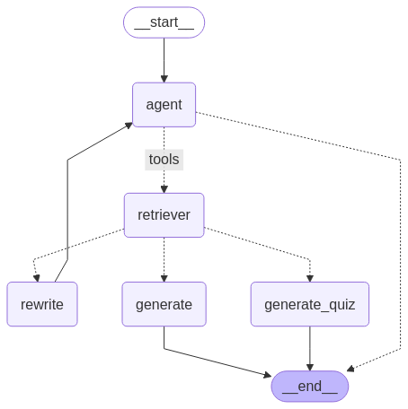

# Agentic-RAG for Clemson Faculty Manual

## Agent Work Flow


# Instructions to run the project

## local setup
Install the required packages
```bash
pip install -r requirements.txt
```

```bash
cd backend
```

```bash
export PYTHONPATH=/home/<your-user-name>/Agentic-Rag-faculty-polacy/backend
```

```bash
uvicorn src.app:app --reload
```

### Running frontend
```bash
cd frontend
```

```
streamlit run streamlit_app.py
```

Access the frontend at `http://localhost:8501`

### Docker setup
```bash
docker-compose up -d --build 
```
To stop the containers
```bash 
docker-compose down
```
